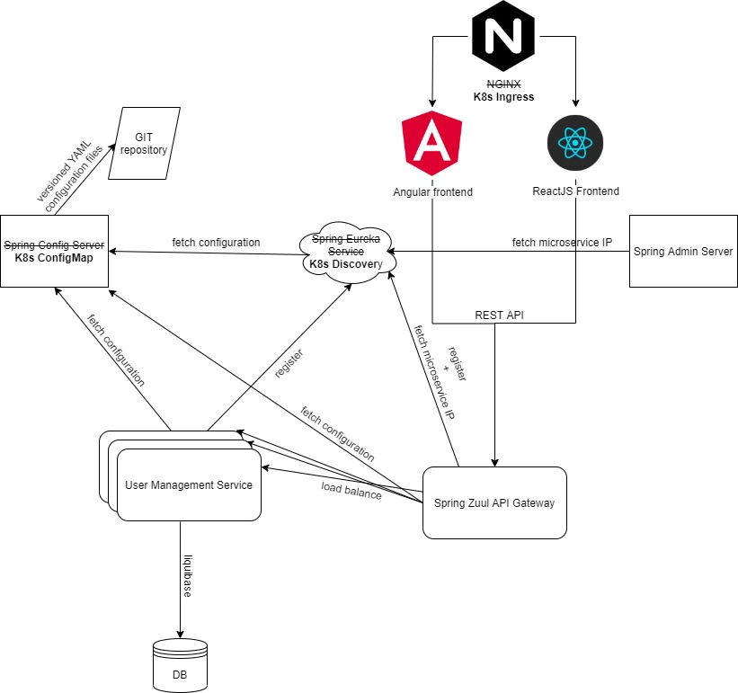

# Docker, Microservices, Spring Cloud, Spring Boot, React, Angular, H2, Hibernate, Liquibase



The application structure is as follows.
- **admin-server** - Microservice implemented using Spring Admin Server. [More info](admin-server/README.md)
- **zuul-gateway-service** - Microservice implemented using Spring Zuul. [More info](zuul-gateway-service/README.md)
- **user-management-service** - Microservice implemented using Spring boot. [More info](user-management-service/README.md)
- **react-client** - A NodeJs application implemented using React. This consumes services hosted by server side. [More info](react-client/README.md)
- **angular-client** - A NodeJs application implemented using Angular. This consumes services hosted by server side. [More info](angular-client/README.md)

### Build

#### 1) Build Spring Boot microservices
   
```
$ cd microservices path
$ mvnw clean install
$ mvnw spring-boot:run
```

#### 2) Build and run client side application

React
```
$ cd react-client
$ yarn install
$ yarn start
```

Angular
```
$ cd angular-client
$ npm install
$ ng serve
```

### Access application using following URL

React
```
http://localhost:3000
```

Angular
```
http://localhost:4200
```

### Kubernetes

#### 1) Build all modules and docker images

```
mvnw clean deploy -P docker
```

#### 2) Run kubernetes

```
$ minikube start
$ minikube addons enable ingress
```

#### 2) Setup hostname

```
$ minikube ip
1.2.3.4
```

Add mysite.com into /etc/hosts (Linux) or C:\Windows\System32\drivers\etc\hosts  (Windows)
```
1.2.3.4 mysite.com
```

#### 3) Configure and run all services

```
$ cd kubernetes
$ kubectl create clusterrolebinding admin-default --clusterrole=cluster-admin --serviceaccount=default:default
$ kubectl apply -f admin-server-service.yaml,admin-server-deployment.yaml
$ kubectl apply -f zuul-gateway-service-service.yaml,zuul-gateway-service-deployment.yaml,zuul-gateway-service-ingress.yaml
$ kubectl apply -f user-management-service-service.yaml,user-management-service-deployment.yaml
$ kubectl apply -f angular-client-service.yaml,angular-client-deployment.yaml
$ kubectl apply -f react-client-service.yaml,react-client-deployment.yaml
```
